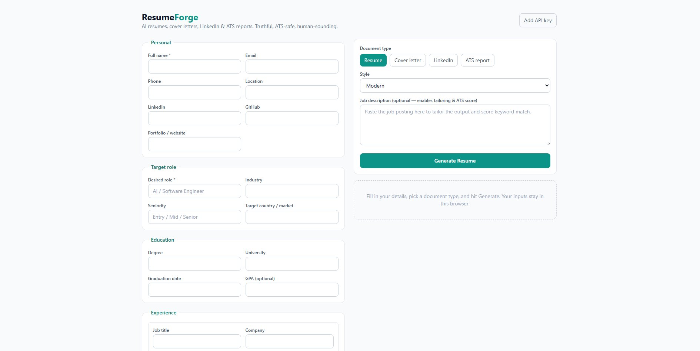

<div align="center">

# ResumeForge

**AI-powered CV, cover letter, LinkedIn & ATS optimizer — truthful, ATS-safe, and human-sounding.**

Paste your details and a job description, and ResumeForge generates a tailored resume,
cover letter, LinkedIn rewrite, or ATS match report, then exports to PDF or DOCX.
Runs on the OpenAI API or, for free, on GitHub Models.

[](https://nextjs.org/)
[](https://www.typescriptlang.org/)
[](https://tailwindcss.com/)
[](LICENSE)
[](https://vercel.com/new)

[Features](#features) · [Screenshots](#screenshots) · [Getting started](#getting-started) · [How it works](#how-it-works) · [Deploy](#deploy)

</div>

> **Suggested GitHub repo description:** AI resume, cover letter, LinkedIn & ATS optimizer built with Next.js + TypeScript. Works free on GitHub Models or on the OpenAI API.
>
> **Suggested topics:** `nextjs` `typescript` `tailwindcss` `openai` `github-models` `resume-builder` `ats` `cover-letter` `career-tools` `llm` `ai`

## Screenshots

> Replace these placeholders with real screenshots once the app is running. Save images to a
> `docs/` folder and reference them here. To capture: run `npm run dev`, open
> http://localhost:3000, and screenshot the views below.

| Intake & generation | ATS match score |
| --- | --- |
|  |  |

| Generated resume preview | Export options |
| --- | --- |
|  |  |

_Tip: a short screen-recording converted to a GIF (saved as `docs/demo.gif`) makes the best
hero image — embed it right under the title with ``._

## Features

- **Resume generator** with five styles: Modern, Executive, Technical, Academic, Student.
- **Tailored cover letters** written for a specific company and role.
- **LinkedIn optimizer**: headline options, About section, experience rewrites, skill picks.
- **ATS report + live match score**: paste a job description, get a keyword-coverage score and a list of missing keywords.
- **Export to PDF and DOCX**, plus copy-to-clipboard.
- **Truthful by design**: the model is instructed never to fabricate employers, dates, degrees, certifications, or metrics.
- **Privacy-friendly**: your profile and API key live only in your browser (localStorage). Keys are forwarded straight to the provider and never stored server-side.

## Getting started

```bash
git clone https://github.com/diwany/resume-forge.git
cd resume-forge
npm install
npm run dev
```

Open http://localhost:3000, click **Add API key**, choose a provider, and paste a key.

### Getting a key

**GitHub Models (free, rate-limited)** — recommended for trying it out:
1. Go to https://github.com/marketplace/models
2. Create a fine-grained Personal Access Token with **Models: read-only** access.
3. Paste it into Settings and pick provider **GitHub Models**. Default model `openai/gpt-4o`.

**OpenAI**:
1. Get a key at https://platform.openai.com/api-keys
2. Paste it into Settings and pick provider **OpenAI**. Default model `gpt-4o`.

### Optional: server-side keys

Instead of entering a key in the UI, copy `.env.example` to `.env.local` and set
`OPENAI_API_KEY` / `OPENAI_MODEL` or `GITHUB_TOKEN` / `GITHUB_MODEL`. The UI key takes
precedence when both are present.

## How it works

```
app/
  page.tsx              # main UI: intake form, controls, results
  api/generate/route.ts # POST endpoint -> builds prompt, calls provider, scores ATS
components/
  IntakeForm.tsx        # structured candidate intake (experience/projects are dynamic)
  ResultPanel.tsx       # rendered preview, ATS badge, export buttons
  SettingsModal.tsx     # provider + API key + model
lib/
  prompts.ts            # prompt engineering: house style, anti-AI rules, per-document tasks
  llm.ts                # one OpenAI-compatible client for OpenAI and GitHub Models
  ats.ts                # keyword extraction + match scoring
  export.ts             # Markdown -> DOCX (docx) and print-to-PDF
  markdown.ts           # tiny Markdown -> HTML renderer for the preview
  types.ts              # shared types
```

The provider abstraction is the interesting part: OpenAI and GitHub Models both speak the
Chat Completions API, so `lib/llm.ts` only swaps the base URL and default model. Adding
another OpenAI-compatible provider (Azure, OpenRouter, a local server) is a few lines.

## Deploy

Deploy to [Vercel](https://vercel.com) in one click — it's a standard Next.js app. If you
want server-side keys, add the env vars in the Vercel dashboard; otherwise users supply
their own key in the UI and nothing needs configuring.

## Scripts

```bash
npm run dev        # start dev server
npm run build      # production build
npm run start      # serve the production build
npm run typecheck  # tsc --noEmit
npm run lint       # next lint
```

## A note on honesty

ResumeForge strengthens weak phrasing and surfaces real achievements, but it will not
invent facts. If a bullet has no metric, it is written well without a fabricated number.
The quality of the output depends on the quality of what you put in.

## License

MIT © Mohamed Diwany
